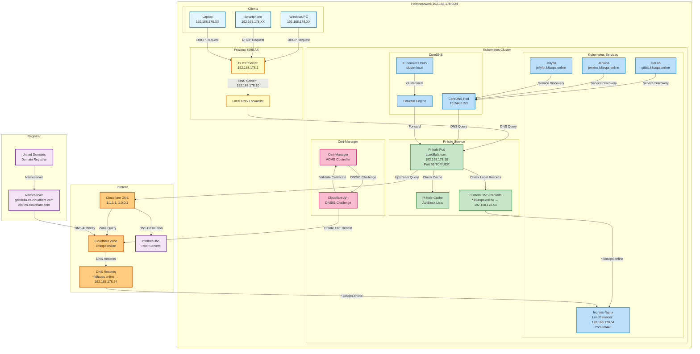

# DNS-Flow Dokumentation: Heimnetzwerk k8sops.online

## Übersicht

Dieses Dokument beschreibt den kompletten DNS-Flow im Heimnetzwerk, einschließlich:
- Client-zu-Internet DNS-Auflösung
- Kubernetes-interne DNS-Auflösung
- Externe DNS-Verwaltung (Cloudflare)
- Cert-Manager DNS-Challenge Integration

## DNS-Flow Diagramm



## Detaillierte Flow-Beschreibung

### 1. Client DNS-Anfrage (Heimnetzwerk)

**Flow:**
```
Client (Windows PC, Smartphone, etc.)
    ↓ [DHCP Request]
Fritzbox DHCP Server (192.168.178.1)
    ↓ [DNS Server: 192.168.178.10]
Fritzbox DNS Forwarder
    ↓ [DNS Query: Port 53 UDP/TCP]
Pi-hole Kubernetes Service (192.168.178.10)
```

**Details:**
- Alle Clients erhalten via DHCP die DNS-Server-IP: `192.168.178.10` (Pi-hole)
- Fritzbox selbst nutzt ebenfalls Pi-hole als lokalen DNS-Server
- Pi-hole läuft als Kubernetes LoadBalancer Service mit fester IP

### 2. Pi-hole DNS-Verarbeitung

**Flow:**
```
DNS Query empfangen
    ↓
[Schritt 1] Cache prüfen
    ↓ [Cache Miss]
[Schritt 2] Local DNS Records prüfen
    ├─ *.k8sops.online → 192.168.178.54 (Ingress)
    └─ [No Match]
[Schritt 3] Ad-Block Lists prüfen
    ├─ Blocked → NXDOMAIN oder 0.0.0.0
    └─ [Not Blocked]
[Schritt 4] Upstream DNS Query
    ↓
Cloudflare DNS (1.1.1.1, 1.0.0.1)
```

**Pi-hole Konfiguration:**
- **Upstream DNS**: Cloudflare (1.1.1.1, 1.0.0.1)
- **Custom DNS Records**: `*.k8sops.online` → `192.168.178.54`
- **Ad-Block Lists**: Aktiviert (Standard-Listen + Custom)
- **Cache**: Aktiviert (30s TTL für cluster.local)

### 3. Kubernetes-interne DNS-Auflösung

**Flow:**
```
Kubernetes Pod/Service
    ↓ [DNS Query]
CoreDNS (10.244.0.2/3)
    ↓
[Schritt 1] Kubernetes Service Discovery
    ├─ *.cluster.local → Kubernetes Service IP
    └─ [No Match]
[Schritt 2] Forward to Pi-hole
    ↓
Pi-hole (192.168.178.10)
    ↓
[Weiterverarbeitung wie Client DNS-Anfrage]
```

**CoreDNS Konfiguration:**
```yaml
forward . 192.168.178.10 8.8.8.8 {
    max_concurrent 1000
}
```

**Service Discovery:**
- `gitlab.gitlab.svc.cluster.local` → GitLab Service IP
- `jenkins.default.svc.cluster.local` → Jenkins Service IP
- `*.k8sops.online` → Wird an Pi-hole weitergeleitet

### 4. Externe DNS-Auflösung (Cloudflare)

**Flow:**
```
Pi-hole Upstream Query
    ↓
Cloudflare DNS (1.1.1.1, 1.0.0.1)
    ↓
[Schritt 1] Cloudflare Zone Query
    ↓
k8sops.online Zone
    ↓
[Schritt 2] DNS Record Lookup
    ├─ *.k8sops.online → 192.168.178.54 (A-Record)
    ├─ gitlab.k8sops.online → 192.168.178.54 (A-Record)
    └─ [External Domain]
[Schritt 3] Internet DNS Resolution
    ↓
Root DNS Servers → TLD → Domain
```

**Cloudflare DNS-Konfiguration:**
- **Nameserver**: `gabriella.ns.cloudflare.com`, `olof.ns.cloudflare.com`
- **DNS Records**: Wildcard `*.k8sops.online` → `192.168.178.54`
- **Proxy Status**: DNS Only (grau, da interne IP)
- **Registrar**: United Domains

### 5. Cert-Manager DNS-Challenge

**Flow:**
```
Cert-Manager ACME Controller
    ↓ [Certificate Request]
Let's Encrypt ACME Server
    ↓ [DNS01 Challenge]
Cert-Manager
    ↓ [Cloudflare API Call]
Cloudflare API Token
    ↓ [Create TXT Record]
Cloudflare Zone: _acme-challenge.k8sops.online
    ↓ [Validation]
Let's Encrypt
    ↓ [Certificate Issued]
Cert-Manager
    ↓ [Store in Kubernetes Secret]
Ingress TLS Certificate
```

**Cert-Manager Konfiguration:**
- **ClusterIssuer**: `letsencrypt-prod-dns01`
- **Challenge**: DNS01 mit Cloudflare
- **API Token**: Secret `cloudflare-api-token`
- **Zertifikate**: 10+ Services (argocd, gitlab, jenkins, etc.)

## IP-Adressen und Ports

### Netzwerk-Übersicht

| Komponente | IP-Adresse | Port(s) | Typ |
|------------|------------|---------|-----|
| Fritzbox | 192.168.178.1 | 53 (DNS Forwarder) | Router |
| Pi-hole Kubernetes | 192.168.178.10 | 53 (TCP/UDP), 80 (Web) | LoadBalancer |
| Kubernetes Ingress | 192.168.178.54 | 80, 443 | LoadBalancer |
| CoreDNS | 10.244.0.2/3 | 53 (TCP/UDP) | ClusterIP |
| Cloudflare DNS | 1.1.1.1, 1.0.0.1 | 53 (TCP/UDP) | Upstream |

### DHCP-Bereich

- **DHCP Range**: `192.168.178.20-50` und `192.168.178.60-200`
- **Reservierungen**:
  - `192.168.178.10` → Pi-hole (außerhalb DHCP-Bereich)
  - `192.168.178.54` → Kubernetes Ingress (außerhalb DHCP-Bereich)

## Sicherheitsaspekte

### DNS-Sicherheit

1. **Ad-Blocking**: Pi-hole blockiert Werbe- und Tracking-Domains
2. **DNS-Rebind-Schutz**: Fritzbox (sollte aktiviert werden)
3. **DNSSEC**: Nicht aktiviert (bewusst, nicht kritisch für privates Setup)
4. **WHOIS Privacy**: Aktiviert (United Domains)
5. **Domain-Lock**: Aktiviert (United Domains)
6. **2FA**: Aktiviert (Cloudflare, United Domains)

### Netzwerk-Sicherheit

1. **Firewall**: Fritzbox NAT/Firewall aktiv
2. **VPN**: WireGuard VPN aktiv (Port 51820)
3. **SSL/TLS**: Cert-Manager mit Let's Encrypt
4. **Ingress**: TLS-Terminierung am Ingress-Controller

## Monitoring und Logging

### Pi-hole Logs

- **Query Logs**: Alle DNS-Anfragen werden geloggt
- **Blocked Domains**: Statistiken über blockierte Anfragen
- **Top Clients**: Welche Geräte machen die meisten Anfragen

### Kubernetes Logs

- **CoreDNS Logs**: `kubectl logs -n kube-system -l k8s-app=kube-dns`
- **Cert-Manager Logs**: `kubectl logs -n cert-manager -l app=cert-manager`
- **Ingress Logs**: `kubectl logs -n ingress-nginx -l app.kubernetes.io/component=controller`

## Troubleshooting

### DNS-Auflösung funktioniert nicht

1. **Prüfe Pi-hole Status:**
   ```bash
   kubectl get pods -n pihole
   kubectl logs -n pihole -l app=pihole
   ```

2. **Teste DNS-Query direkt:**
   ```bash
   dig @192.168.178.10 google.com
   dig @192.168.178.10 gitlab.k8sops.online
   ```

3. **Prüfe Fritzbox DNS-Konfiguration:**
   - Heimnetz → Netzwerk → IPv4 → Lokaler DNS-Server: `192.168.178.10`

### Kubernetes Services nicht erreichbar

1. **Prüfe CoreDNS:**
   ```bash
   kubectl get pods -n kube-system -l k8s-app=kube-dns
   kubectl exec -n kube-system <coredns-pod> -- nslookup gitlab.k8sops.online
   ```

2. **Prüfe Ingress:**
   ```bash
   kubectl get ingress -A
   kubectl describe ingress -n default gitlab-ingress
   ```

### Cert-Manager Zertifikate

1. **Prüfe Certificate Status:**
   ```bash
   kubectl get certificates -A
   kubectl describe certificate -n gitlab gitlab-tls
   ```

2. **Prüfe CertificateRequest:**
   ```bash
   kubectl get certificaterequests -A
   kubectl describe certificaterequest -n gitlab <certificate-request-name>
   ```

## Versionierung

- **Dokumentation**: 2025-11-05
- **Fritzbox**: FRITZ!OS 8.20
- **Kubernetes**: v1.28.x (kubeadm)
- **Pi-hole**: Latest (Kubernetes)
- **CoreDNS**: v1.10.1
- **Cert-Manager**: v1.13.x

## Referenzen

- [Pi-hole Dokumentation](https://docs.pi-hole.net/)
- [CoreDNS Dokumentation](https://coredns.io/manual/)
- [Cert-Manager Dokumentation](https://cert-manager.io/docs/)
- [Cloudflare DNS Dokumentation](https://developers.cloudflare.com/dns/)
- [Fritzbox Dokumentation](https://en.avm.de/service/fritzbox/fritzbox-7590-ax/knowledge-base/)

