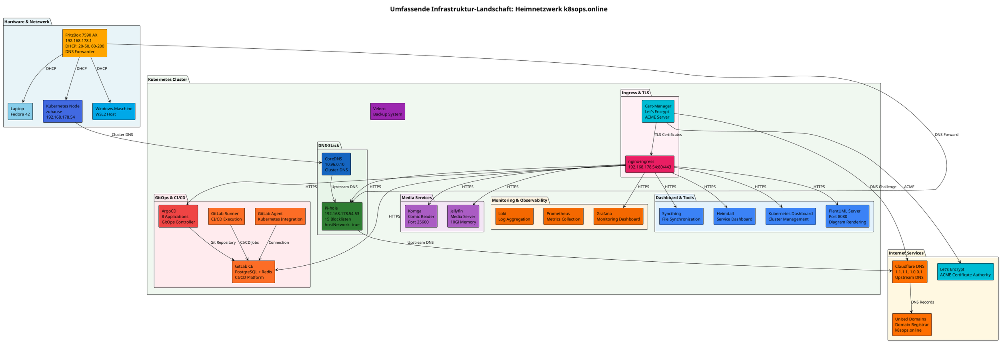

# Umfassende Infrastruktur-Dokumentation: Heimnetzwerk k8sops.online

**Erstellt:** 2025-11-09  
**Stand:** Aktuell  
**Domain:** k8sops.online

---

## 📋 Inhaltsverzeichnis

1. [Übersicht](#übersicht)
2. [Hardware & Netzwerk](#hardware--netzwerk)
3. [Kubernetes Cluster](#kubernetes-cluster)
4. [Services & Anwendungen](#services--anwendungen)
5. [Netzwerk-Topologie](#netzwerk-topologie)
6. [DNS-Konfiguration](#dns-konfiguration)
7. [Sicherheit & TLS](#sicherheit--tls)
8. [Monitoring & Observability](#monitoring--observability)
9. [Backup & Disaster Recovery](#backup--disaster-recovery)
10. [Zugangsdaten & Web-Interfaces](#zugangsdaten--web-interfaces)

---

## 🏗️ Übersicht

Diese Dokumentation beschreibt die komplette Infrastruktur-Landschaft des Heimnetzwerks **k8sops.online**. Die Infrastruktur basiert auf einem Kubernetes-Cluster mit GitOps-Prinzipien (ArgoCD) und umfasst DNS-Management, Media-Services, Monitoring, CI/CD und verschiedene Dashboard-Tools.

### Infrastruktur-Diagramm (PlantUML)



**Gerendertes Diagramm:**

![Infrastruktur-Diagramm Komplett](https://plantuml.k8sops.online/png/eJyFVktz4jgQvvtXaEPVzmEHxjxMDIetAWMnmSEZNiQze_BF2MJosSWXLE9Ctua_b0s2xganlhRVQd39qR9fd-tzJrGQeRKjO7YVOJMi38tcdJeYhVmww1vZ_cqTNCZSGr_JHUkISmNMmZHtKUuxwAna4GAfCZ6z0OExF6jj6U9NIwAEzgiTa3mICRIkkJhFMTEMSSUcPCdbnGWEheRdL6boltCEEfn2QsQe7e2Mp1mPs5gygEnBBRwRdHWLRfiCBUG_o4dS9wp1XNsbeTb610AnV9CVJ6h8m_NXdG1NTDT722f9yaDXH9u9_jV8fba4dVZTNDC7lvkRjc3uwDTh8GGNPC7gkpCIK4QztFU4G8CBwGeWaTZv-ZpviAC_SYYeeEh89pbvcJ6R5m3WSENBWAyUUGfUH0_cfhPpB2Uhf8m69xhSAmH77Md6OUC3PJPa-KWQo45pzmzXbhovcSp56jOPhFxgNBpok1ifoo597bju3PhVy2TNbyfOM6mC7XimZ3umTmSlCAnpriX8KhJtuRMtb9y-ot0djy9inlpDOLLQPObBPqZwCfPZDuKB2r1wsZ8iIALRnqZUAaDOwL1eDAfn-A4XBPwAMLM3GffMXh8qVbqNQKAhAlAKGeSnb40tR5XpF3zrodyxSJAsA_I8LddXmsimZ12GwyLKXru00L4IyjY_jUZDfWWpAomZ9N3x8MJtIiSUk8HlwmdLIj9kyGWBOKTSZzPn3kVrIn6WNAtAOYmEKu_cWYxa3L-h8luqvHfuPjkL7b87d91L_2ci4s7CZzaapWlMAywpZxBICeBwJgWP4_JiDNpBCDF4I_icY4HNEm-Q4_psBZWDeNd_LdEf6JGEFCC1K2gVY7nlItF4EfQ8WHQ8Z7wYjN_Bm0Xwy2c1Ft4xSSKhXa3BYKX3P1iPOWMqwYUv7isJ8jMUoTVqMOepvYdosK4GDUimUjt0rTZqfCFxfNhS4PHJRN3dN28ouicJFwd97z-lHurMZpbjXFADhm6EwWWe0AByiUMFsuJCooE1Ns1iWiidGsCF05xRyQWQEDjxbZOBK3hDYyoPBbeHrnkZwI3AW2Ak-H-yXuBst-Ew8YqUFRoAMRrbetw1e13whMCmyDOVAylooBgFbAqqpKeVynsgS76n0BE8AiIApaJT2WOQ1KzOY65cVU3Meaxq5Q69gbe4DFVtlBDHsc_Kwp4FuivlqDOc2wPvgl41claGp7FT9HUCmsfRHoLSe1jQIUw-3y8rwuha26atVg7FkVqjj2pDqoIUSVQWanG_g7g-sEDCnohg6FMYner3TkBR307JzI46NZAyozWk7wRGAffZHJKcpwAE8RWt_FNLUGfiDK7nZmN_qHZVyWk0jefZbv98Dzsxz8NtrLZ2McN7-u8j6sMgN9Uifk7hRUAgA9UoP5kA6Ng7X7pto1QNW7pVw46gWS53QG1Z9CI8buDxoXVr07UG9wydQEK04Am8fIDWxT9Qjwh2lsBQrcZ7RIPm2iYsTCovIUMfqpdJ9zsRG1jaOYMhZlTPiG73z-ohMEXqEdKUHfd8m6xc6G2icoNOUe0FYxjHi5TGcUFOUW11GsfTBka9IkZ5qiFOhTlTMo67UKmVKwUedU9Pq3VDVG6HNlE1M9uExTBsRSznVZusavFWyLJl22RV97UJT23VanpMYiEyjotd169GxSlSvG2IG-lVdXR24DwB_jTUjrdN1TumTvzMMMrUN1INexLInPJMDfyDUd-sDT14GLBijBuNvdlU0lv2C9_AZTV_lU6zJ4oIHgkQLATdzzDdIKH_AcA8Cg4=)

---

## 🖥️ Hardware & Netzwerk

### FritzBox 7590 AX
- **IP-Adresse:** 192.168.178.1
- **Funktionen:**
  - DHCP-Server (Bereiche: 20-50, 60-200)
  - DNS-Forwarder (weiterleitung an Pi-hole)
  - Router & Firewall
  - WLAN Access Point

### Kubernetes Node
- **Hostname:** zuhause
- **IP-Adresse:** 192.168.178.54
- **Rolle:** Single-Node Kubernetes Cluster
- **Betriebssystem:** Linux (WSL2 auf Windows-Host)
- **Node-Selector:** `workload-type: production`

### Windows-Maschine
- **Rolle:** WSL2 Host
- **Funktion:** Host-System für Kubernetes Node

### Laptop
- **Betriebssystem:** Fedora 42
- **Rolle:** Entwicklungs- und Verwaltungsrechner

### Netzwerk
- **Subnetz:** 192.168.178.0/24
- **DHCP-Bereiche:** 
  - 20-50 (statische Reservierungen)
  - 60-200 (dynamische Zuweisungen)
- **DNS-Weiterleitung:** FritzBox → Pi-hole (192.168.178.54:53)

---

## ☸️ Kubernetes Cluster

### Cluster-Konfiguration
- **Typ:** Single-Node Cluster
- **Pod-Netzwerk:** 10.244.0.0/16
- **Service-Netzwerk:** 10.96.0.0/12
- **CoreDNS:** 10.96.0.10

### Namespaces
- `argocd` - ArgoCD GitOps Controller
- `gitlab` - GitLab CE mit PostgreSQL und Redis
- `pihole` - Pi-hole DNS Server
- `jellyfin` - Media Server
- `komga` - Comic Reader
- `heimdall` - Service Dashboard
- `syncthing` - File Synchronization
- `plantuml` - PlantUML Server
- `default` - Standard-Namespace für verschiedene Services

---

## 🔧 Services & Anwendungen

### DNS-Stack

#### Pi-hole
- **Namespace:** `pihole`
- **IP:** 192.168.178.54:53
- **Konfiguration:**
  - `hostNetwork: true` (direkter Port-Zugriff)
  - Deployment-Strategie: `RollingUpdate` (maxUnavailable: 0, maxSurge: 1)
  - 15 Blocklisten aktiv
- **Upstream DNS:** Cloudflare (1.1.1.1, 1.0.0.1)
- **Persistent Storage:** NFS (`nfs-data` StorageClass)

#### CoreDNS
- **Cluster-DNS:** 10.96.0.10
- **Funktion:** Interne DNS-Auflösung für Kubernetes-Services
- **Upstream:** Pi-hole

### Ingress & TLS

#### nginx-ingress
- **IP:** 192.168.178.54:80/443
- **Funktion:** Reverse Proxy für alle HTTPS-Services
- **TLS-Terminierung:** Cert-Manager mit Let's Encrypt

#### Cert-Manager
- **Funktion:** Automatische TLS-Zertifikat-Verwaltung
- **ACME-Server:** Let's Encrypt
- **DNS-Challenge:** Cloudflare
- **Zertifikate:** Für alle `*.k8sops.online` Domains

### GitOps & CI/CD

#### ArgoCD
- **Namespace:** `argocd`
- **Anzahl Applications:** 8
- **Funktion:** GitOps Controller für automatische Deployment-Synchronisation
- **Features:**
  - Automated Sync
  - Self-Healing
  - Prune
- **Applications:**
  - gitlab
  - heimdall
  - jellyfin
  - komga
  - kubernetes-dashboard
  - pihole
  - plantuml
  - syncthing

#### GitLab CE
- **Namespace:** `gitlab`
- **Komponenten:**
  - GitLab CE (Hauptanwendung)
  - PostgreSQL (externe Datenbank)
  - Redis (externe Cache)
- **Ressourcen:**
  - CPU: 100m Request, 2 Limit
  - Memory: 4Gi Request, 6Gi Limit
- **Features:**
  - Git Repository Management
  - CI/CD Pipelines
  - Container Registry (deaktiviert)
  - GitLab Pages (deaktiviert)

#### GitLab Agent
- **Funktion:** Kubernetes-Integration für GitLab
- **Verbindung:** Zu GitLab CE

#### GitLab Runner
- **Funktion:** CI/CD Job Execution
- **Verbindung:** Zu GitLab CE

### Media Services

#### Jellyfin
- **Namespace:** `jellyfin`
- **Funktion:** Media Server für Video- und Audio-Streaming
- **Ressourcen:** 10Gi Memory
- **Zugriff:** Über nginx-ingress (HTTPS)

#### Komga
- **Namespace:** `komga`
- **Port:** 25600
- **Funktion:** Comic Reader und Management
- **Zugriff:** Über nginx-ingress (HTTPS)

### Monitoring & Observability

#### Grafana
- **Funktion:** Monitoring Dashboard
- **Datenquellen:** Prometheus, Loki
- **Zugriff:** Über nginx-ingress (HTTPS)

#### Prometheus
- **Funktion:** Metrics Collection und Storage
- **Zielgruppen:** Alle Kubernetes-Services

#### Loki
- **Funktion:** Log Aggregation
- **Integration:** Mit Grafana

### Dashboard & Tools

#### Heimdall
- **Namespace:** `heimdall`
- **Funktion:** Service Dashboard mit Links zu allen Services
- **Zugriff:** Über nginx-ingress (HTTPS)

#### Kubernetes Dashboard
- **Funktion:** Web-UI für Cluster-Management
- **Zugriff:** Über nginx-ingress (HTTPS)

#### PlantUML Server
- **Namespace:** `plantuml`
- **Port:** 8080
- **Funktion:** Diagram Rendering für Markdown-Dokumentation
- **Zugriff:** Über nginx-ingress (HTTPS)
- **URL:** https://plantuml.k8sops.online

#### Syncthing
- **Namespace:** `syncthing`
- **Funktion:** File Synchronization zwischen Geräten
- **Zugriff:** Über nginx-ingress (HTTPS)

### Backup

#### Velero
- **Funktion:** Backup-System für Kubernetes-Ressourcen
- **Status:** Installiert, Konfiguration in Arbeit

---

## 🌐 Netzwerk-Topologie

### DNS-Flow

```
Internet (Cloudflare DNS)
    ↑
    | Upstream DNS
    |
Pi-hole (192.168.178.54:53)
    ↑
    | DNS Forward
    |
FritzBox (192.168.178.1)
    ↑
    | DHCP + DNS
    |
Clients (Windows, Laptop, etc.)
```

### Kubernetes DNS-Flow

```
Kubernetes Pods
    ↓
CoreDNS (10.96.0.10)
    ↓
Pi-hole (192.168.178.54:53)
    ↓
Cloudflare DNS (1.1.1.1, 1.0.0.1)
```

### HTTPS-Flow

```
Internet
    ↓
nginx-ingress (192.168.178.54:443)
    ↓ (TLS-Terminierung)
    ↓
Services (ArgoCD, GitLab, Jellyfin, etc.)
```

---

## 🔐 Sicherheit & TLS

### TLS-Zertifikate
- **Provider:** Let's Encrypt (via Cert-Manager)
- **DNS-Challenge:** Cloudflare
- **Domains:** `*.k8sops.online`
- **Automatische Erneuerung:** Ja

### Netzwerk-Sicherheit
- **Firewall:** FritzBox (erste Verteidigungslinie)
- **Ingress:** nginx-ingress mit TLS-Terminierung
- **Interne Kommunikation:** Kubernetes Service Mesh (Cluster-intern)

---

## 📊 Monitoring & Observability

### Metriken
- **Sammlung:** Prometheus
- **Visualisierung:** Grafana
- **Zielgruppen:** Alle Kubernetes-Services

### Logs
- **Aggregation:** Loki
- **Visualisierung:** Grafana
- **Retention:** Konfiguriert

### Alerts
- **Status:** In Konfiguration

---

## 💾 Backup & Disaster Recovery

### Velero
- **Status:** Installiert
- **Funktion:** Kubernetes-Ressourcen-Backup
- **Konfiguration:** In Arbeit

### Persistent Volumes
- **Storage Classes:**
  - `local-path` - Lokaler Storage
  - `nfs-data` - NFS-basierter Storage (für Pi-hole, GitLab, etc.)

---

## 🔑 Zugangsdaten & Web-Interfaces

### ArgoCD
- **URL:** https://argocd.k8sops.online
- **Zugangsdaten:** Siehe `webinterfaces-zugangsdaten-2025-11-08.md`

### GitLab
- **URL:** https://gitlab.k8sops.online
- **Benutzer:** root
- **Zugangsdaten:** Siehe `webinterfaces-zugangsdaten-2025-11-08.md`

### Jellyfin
- **URL:** https://jellyfin.k8sops.online
- **Zugangsdaten:** Siehe `webinterfaces-zugangsdaten-2025-11-08.md`

### Komga
- **URL:** https://komga.k8sops.online
- **Zugangsdaten:** Siehe `webinterfaces-zugangsdaten-2025-11-08.md`

### Grafana
- **URL:** https://grafana.k8sops.online
- **Zugangsdaten:** Siehe `webinterfaces-zugangsdaten-2025-11-08.md`

### Heimdall
- **URL:** https://heimdall.k8sops.online
- **Funktion:** Service Dashboard mit Links zu allen Services

### Kubernetes Dashboard
- **URL:** https://kubernetes-dashboard.k8sops.online
- **Zugangsdaten:** Siehe `webinterfaces-zugangsdaten-2025-11-08.md`

### PlantUML Server
- **URL:** https://plantuml.k8sops.online
- **Funktion:** Diagram Rendering für Markdown

### Pi-hole Admin
- **URL:** https://pihole.k8sops.online
- **Zugangsdaten:** Siehe `webinterfaces-zugangsdaten-2025-11-08.md`

### Syncthing
- **URL:** https://syncthing.k8sops.online
- **Zugangsdaten:** Siehe `webinterfaces-zugangsdaten-2025-11-08.md`

---

## 📝 Anmerkungen

- **GitOps:** Alle Services werden über ArgoCD aus Git-Repositories deployt
- **Deployment-Strategien:** 
  - Pi-hole: `RollingUpdate` (wegen `hostNetwork: true`)
  - Andere Services: Standard-Strategien
- **Persistent Storage:** Wichtige Daten auf NFS (`nfs-data`)
- **Monitoring:** Prometheus + Grafana für Metriken, Loki für Logs

---

**Ende der Dokumentation**

*Letzte Aktualisierung: 2025-11-09*
