# Umfassende Infrastruktur-Dokumentation: Heimnetzwerk k8sops.online

**Erstellt:** 2025-11-09  
**Stand:** Aktuell  
**Domain:** k8sops.online

---

## 📋 Inhaltsverzeichnis

1. [Übersicht](#übersicht)
2. [Hardware & Netzwerk](#hardware--netzwerk)
3. [Kubernetes Cluster](#kubernetes-cluster)
4. [Services & Anwendungen](#services--anwendungen)
5. [Netzwerk-Topologie](#netzwerk-topologie)
6. [DNS-Konfiguration](#dns-konfiguration)
7. [Sicherheit & TLS](#sicherheit--tls)
8. [Monitoring & Observability](#monitoring--observability)
9. [Backup & Disaster Recovery](#backup--disaster-recovery)
10. [Zugangsdaten & Web-Interfaces](#zugangsdaten--web-interfaces)

---

## 🏗️ Übersicht

Diese Dokumentation beschreibt die komplette Infrastruktur-Landschaft des Heimnetzwerks **k8sops.online**. Die Infrastruktur basiert auf einem Kubernetes-Cluster mit GitOps-Prinzipien (ArgoCD) und umfasst DNS-Management, Media-Services, Monitoring, CI/CD und verschiedene Dashboard-Tools.

### Infrastruktur-Diagramm (PlantUML)

```plantuml
@startuml Infrastruktur-Landschaft-Umfassend
!theme plain
skinparam backgroundColor #FFFFFF
skinparam componentStyle rectangle
skinparam linetype ortho

title Umfassende Infrastruktur-Landschaft: Heimnetzwerk k8sops.online

package "Hardware & Netzwerk" #E8F4F8 {
  component "FritzBox 7590 AX\n192.168.178.1\nDHCP: 20-50, 60-200\nDNS Forwarder" as fritzbox #FFA500
  component "Kubernetes Node\nzuhause\n192.168.178.54\nSingle-Node Cluster" as k8snode #4169E1
  component "Windows-Maschine\nWSL2 Host" as windows #00A8E8
  component "Laptop\nFedora 42" as laptop #87CEEB
}

package "Kubernetes Cluster" #F0F8F0 {
  package "DNS-Stack" #E8F5E9 {
    component "Pi-hole\n192.168.178.54:53\n15 Blocklisten\nhostNetwork: true\nRollingUpdate" as pihole #2E7D32
    component "CoreDNS\n10.96.0.10\nCluster DNS" as coredns #1565C0
  }
  
  package "Ingress & TLS" #FFF0F5 {
    component "nginx-ingress\n192.168.178.54:80/443\nLoadBalancer" as ingress #E91E63
    component "Cert-Manager\nLet's Encrypt\nACME Server\nDNS Challenge" as certmgr #00BCD4
  }
  
  package "GitOps & CI/CD" #FFEBEE {
    component "ArgoCD\n8 Applications\nGitOps Controller\nAuto-Sync + Self-Heal" as argocd #EF4444
    component "GitLab CE\nPostgreSQL + Redis\nCI/CD Platform\n2 CPU, 6Gi Memory" as gitlab #FC6D26
    component "GitLab Agent\nKubernetes Integration" as gitlabagent #FC6D26
    component "GitLab Runner\nCI/CD Execution" as gitlabrunner #FC6D26
  }
  
  package "Media Services" #F3E5F5 {
    component "Jellyfin\nMedia Server\n10Gi Memory" as jellyfin #AA5CC3
    component "Komga\nComic Reader\nPort 25600" as komga #AA5CC3
  }
  
  package "Monitoring & Observability" #FFF3E0 {
    component "Grafana\nMonitoring Dashboard\nPrometheus + Loki" as grafana #F46800
    component "Prometheus\nMetrics Collection\nPort 9090" as prometheus #F46800
    component "Loki\nLog Aggregation\nPort 3100" as loki #F46800
  }
  
  package "Dashboard & Tools" #E3F2FD {
    component "Heimdall\nService Dashboard\nPublic Access" as heimdall #3B82F6
    component "Kubernetes Dashboard\nCluster Management\nService Account Auth" as k8sdash #3B82F6
    component "PlantUML Server\nPort 8080\nDiagram Rendering" as plantuml #3B82F6
    component "Syncthing\nFile Synchronization\nPort 22000" as syncthing #3B82F6
  }
  
  component "Velero\nBackup System\nPort 8085" as velero #9C27B0
}

package "Internet Services" #FFF8E1 {
  component "Cloudflare DNS\n1.1.1.1, 1.0.0.1\nUpstream DNS\nDNS Challenge" as cloudflare #FF6F00
  component "Let's Encrypt\nACME Certificate Authority\nTLS Certificates" as letsencrypt #00BCD4
  component "United Domains\nDomain Registrar\nk8sops.online" as uniteddomains #FF6F00
}

' Netzwerk-Verbindungen Hardware
fritzbox --> k8snode : DHCP + DNS Forward
fritzbox --> windows : DHCP
fritzbox --> laptop : DHCP

' DNS-Flow
k8snode --> coredns : Cluster DNS
coredns --> pihole : Upstream DNS
pihole --> cloudflare : Upstream DNS
fritzbox --> pihole : DNS Forward

' Ingress zu Services
ingress --> argocd : HTTPS (argocd.k8sops.online)
ingress --> gitlab : HTTPS (gitlab.k8sops.online)
ingress --> jellyfin : HTTPS (jellyfin.k8sops.online)
ingress --> komga : HTTPS (komga.k8sops.online)
ingress --> grafana : HTTPS (grafana.k8sops.online)
ingress --> prometheus : HTTPS (prometheus.k8sops.online)
ingress --> heimdall : HTTPS (heimdall.k8sops.online)
ingress --> k8sdash : HTTPS (dashboard.k8sops.online)
ingress --> plantuml : HTTPS (plantuml.k8sops.online)
ingress --> syncthing : HTTPS (syncthing.k8sops.online)
ingress --> pihole : HTTPS (pihole.k8sops.online)

' TLS & Certificates
certmgr --> letsencrypt : ACME Protocol
certmgr --> cloudflare : DNS Challenge
certmgr --> ingress : TLS Certificates

' GitOps Flow
argocd --> gitlab : Git Repository Sync
gitlabagent --> gitlab : Kubernetes Connection
gitlabrunner --> gitlab : CI/CD Jobs

' Monitoring Flow
grafana --> prometheus : Metrics Query
grafana --> loki : Log Query

' Domain & DNS
cloudflare --> uniteddomains : DNS Records
cloudflare --> ingress : DNS Resolution

@enduml
```



**Gerendertes Diagramm:**

![Infrastruktur-Diagramm Komplett](https://plantuml.k8sops.online/png/eJyFV1tz2jgUfvev0IaZdne2UHON4WGnYOwmLWlpaNp94EXYwniRJY8sNyU7_e97JNnGhoRNJzOxdM53rjrn67tMYiHzhKJbthU4kyLfy1y0F5iFWbDDW9l-SLY4ywgLrd_kjiQEpRTHzMr2MUuxwAna4GAfCZ6z0OWUC9Ty9U9NIuBJyhlhciUPlCBBAolZRElNhMaMyENKEBdyxy1LxhIkK9vkRf8m6IbECSg_PRKxR3sn42nW4UwBWlYKvuGIoKsbLMJHLAh6hT4Vsleo5Tn-wHfQvxY6-oiufBHLpxn_ia6HYxtN_16z7rjX6Y6cTvcaftdsfuMuJ6hnt4f2GzSy2z3bhsNPK-RzAUZCIq4QztBW4WwABzIyHdp208rHfEME-E0y9ImHZM2e8h3OM9K0Nhys2SpWyWorKeTSPJMFPsTK1Flr0B2NvW4T_nvMQv6Yte8w5AlysWbfV4seuuGZ1MqP5h61bHvqeE5TeYFTydM180nIBUaDnlah-hS1nGvX82bWr1p6a8FUHrZ823d8W2e3EoQstVcSvkz2h95Y3zesL-P2jtOzREyGfTgaohnlwZ7GYISt2Q7igYI-crGfIOgO0LrnFIofPaQhlkQ7nsYKD7V63vW83zs153JBwC3AtjvjUcfudKGaRRQILjREAEIhg3R1h6Ohq0r5C37rkd2ySJAsgwb7ulhd6Vdg-8Pz6FgUs5_t2EifxejYbwcDiHPBcTjDFLOgKHahAFkbd71R_ywIIiTUmoErArSJfJ0hjwXikMo1m7p3HloR8UPdqT51d5hSwiKTHjAhk0ioVpi588Ezsb2P5edUhebevnXnOjhv5nnnwU1FxN35mjlomqY0DrCMOYMoCwCXMymgPMqPaS55e3VgAfoTfKPb9g3BVPuDASQIIVJ_AD-nJgBqgTfI9dZsCcWHrKy-LADjnoQxWNIeoiXFcstFsmY95C4f4JW-j9EdSbg4aBMRjBcAafnuaN4bvWBiGsHXmtV6-5ZJEgkdVA0GK7n_wbrPGVNRG_e8nyTIT1CElqjBnBbhDgLEuoxxQDJVhL43fK7DPhBKD9sYXsdRRdnu2s0k_FPIodZ0OnTds576yJMIg8s8iQNILw4VyBIGNOoNR7ZtZpCSqQGcOc1ZLLmA7oXu-bzJwBW8iWksD-aJ9D37PID3Am-hlcH_o_YcZ7sNh-EKLgieENhFeQZlX_B9bLJolAB1MHL0sG0OlUpJpUWKOFDtCK0YqDoUcY3tsQkrPZp4AU_ZVc80gjaBHoxwDabfLbJDQagGcJqcKiY1NDinqqhe3-_58_OcqC0XwquFdWA6oJGRfAOPDU0DaIxMW94V4qjVnzk9_6wta01dwymnnhkkiW7_0hyAw46XCN7trlw_Iai-ZAGeIJMPd4uq_XRqHNtRuzLGkdr692q1q_KapCsNxUVeQFTDQsIui2AxxTDP1fdOQIs81ZPfg21ssp-V8jXAogQ11G8ExhFfsxlUJU8BFDKQHL0daqgfWgi1xm7vemY3Vp-aCSqTjZfp-47XPeUVLuV5uKWKhZh909H_3qAuLB1bEYuHFBgOgcTo-2cm9REBbIz8U07x3NxXmyHeqlFMdO3gOcnDmsGSql-ZrqFEAtvS2rVtUDPwAO-RhGjOE-CA8JLMH1DHCPaxwFDlBgHToLnWCY1K5Tek8HVFxdrfiNgAIckhUIZKrmZVBKrd_qtiOxOk6Be8_BrhakqW1MZINu8KDlNcgQuKkPiUP1olvpIqt_0E1XiAVZ4qiYJSTFC9ZFZxqiGOpToRavhT4dSjAbdKNvGUV31llRRA6RU7Etjv16_LFfrdfHca2f-joVGsvErDfF_SqPZDpVOeXNIyG6FS0Z8X_Srm9tExc3BJpzaeK7Xj2SXNai5WeuXJxZiKUVcpheXMvOhlOc-OPhYnl7SOU6tSq44uWis7qbSlv081oLXUy3_VePtWyQD1C6nNgAnSIwR2p-QBpw25RoM3RlVDrHRxgk4njvKl4IX6ARYt3ehVuIfhkvJM0YCDnvhWnXQ1hOv_CeFApvRmtxrsqiFvuNgHvtGu1LiGdqfsy7N-K9nDl5yIQ0NMr_sJUqTAXKr5YibkKzNBjjlT8s3JaLJ4T2DMhNmp6DGNRijjVBNIy3oHOxRa6j-4gCkE)

---

## 🖥️ Hardware & Netzwerk

### FritzBox 7590 AX
- **IP-Adresse:** 192.168.178.1
- **Funktionen:**
  - DHCP-Server (Bereiche: 20-50, 60-200)
  - DNS-Forwarder (weiterleitung an Pi-hole)
  - Router & Firewall
  - WLAN Access Point

### Kubernetes Node
- **Hostname:** zuhause
- **IP-Adresse:** 192.168.178.54
- **Rolle:** Single-Node Kubernetes Cluster
- **Betriebssystem:** Linux (WSL2 auf Windows-Host)
- **Node-Selector:** `workload-type: production`

### Windows-Maschine
- **Rolle:** WSL2 Host
- **Funktion:** Host-System für Kubernetes Node

### Laptop
- **Betriebssystem:** Fedora 42
- **Rolle:** Entwicklungs- und Verwaltungsrechner

### Netzwerk
- **Subnetz:** 192.168.178.0/24
- **DHCP-Bereiche:** 
  - 20-50 (statische Reservierungen)
  - 60-200 (dynamische Zuweisungen)
- **DNS-Weiterleitung:** FritzBox → Pi-hole (192.168.178.54:53)

---

## ☸️ Kubernetes Cluster

### Cluster-Konfiguration
- **Typ:** Single-Node Cluster
- **Pod-Netzwerk:** 10.244.0.0/16
- **Service-Netzwerk:** 10.96.0.0/12
- **CoreDNS:** 10.96.0.10

### Namespaces
- `argocd` - ArgoCD GitOps Controller
- `gitlab` - GitLab CE mit PostgreSQL und Redis
- `pihole` - Pi-hole DNS Server
- `jellyfin` - Media Server
- `komga` - Comic Reader
- `heimdall` - Service Dashboard
- `syncthing` - File Synchronization
- `plantuml` - PlantUML Server
- `default` - Standard-Namespace für verschiedene Services

---

## 🔧 Services & Anwendungen

### DNS-Stack

#### Pi-hole
- **Namespace:** `pihole`
- **IP:** 192.168.178.54:53
- **Konfiguration:**
  - `hostNetwork: true` (direkter Port-Zugriff)
  - Deployment-Strategie: `RollingUpdate` (maxUnavailable: 0, maxSurge: 1)
  - 15 Blocklisten aktiv
- **Upstream DNS:** Cloudflare (1.1.1.1, 1.0.0.1)
- **Persistent Storage:** NFS (`nfs-data` StorageClass)

#### CoreDNS
- **Cluster-DNS:** 10.96.0.10
- **Funktion:** Interne DNS-Auflösung für Kubernetes-Services
- **Upstream:** Pi-hole

### Ingress & TLS

#### nginx-ingress
- **IP:** 192.168.178.54:80/443
- **Funktion:** Reverse Proxy für alle HTTPS-Services
- **TLS-Terminierung:** Cert-Manager mit Let's Encrypt

#### Cert-Manager
- **Funktion:** Automatische TLS-Zertifikat-Verwaltung
- **ACME-Server:** Let's Encrypt
- **DNS-Challenge:** Cloudflare
- **Zertifikate:** Für alle `*.k8sops.online` Domains

### GitOps & CI/CD

#### ArgoCD
- **Namespace:** `argocd`
- **Anzahl Applications:** 8
- **Funktion:** GitOps Controller für automatische Deployment-Synchronisation
- **Features:**
  - Automated Sync
  - Self-Healing
  - Prune
- **Applications:**
  - gitlab
  - heimdall
  - jellyfin
  - komga
  - kubernetes-dashboard
  - pihole
  - plantuml
  - syncthing

#### GitLab CE
- **Namespace:** `gitlab`
- **Komponenten:**
  - GitLab CE (Hauptanwendung)
  - PostgreSQL (externe Datenbank)
  - Redis (externe Cache)
- **Ressourcen:**
  - CPU: 100m Request, 2 Limit
  - Memory: 4Gi Request, 6Gi Limit
- **Features:**
  - Git Repository Management
  - CI/CD Pipelines
  - Container Registry (deaktiviert)
  - GitLab Pages (deaktiviert)

#### GitLab Agent
- **Funktion:** Kubernetes-Integration für GitLab
- **Verbindung:** Zu GitLab CE

#### GitLab Runner
- **Funktion:** CI/CD Job Execution
- **Verbindung:** Zu GitLab CE

### Media Services

#### Jellyfin
- **Namespace:** `jellyfin`
- **Funktion:** Media Server für Video- und Audio-Streaming
- **Ressourcen:** 10Gi Memory
- **Zugriff:** Über nginx-ingress (HTTPS)

#### Komga
- **Namespace:** `komga`
- **Port:** 25600
- **Funktion:** Comic Reader und Management
- **Zugriff:** Über nginx-ingress (HTTPS)

### Monitoring & Observability

#### Grafana
- **Funktion:** Monitoring Dashboard
- **Datenquellen:** Prometheus, Loki
- **Zugriff:** Über nginx-ingress (HTTPS)

#### Prometheus
- **Funktion:** Metrics Collection und Storage
- **Zielgruppen:** Alle Kubernetes-Services

#### Loki
- **Funktion:** Log Aggregation
- **Integration:** Mit Grafana

### Dashboard & Tools

#### Heimdall
- **Namespace:** `heimdall`
- **Funktion:** Service Dashboard mit Links zu allen Services
- **Zugriff:** Über nginx-ingress (HTTPS)

#### Kubernetes Dashboard
- **Funktion:** Web-UI für Cluster-Management
- **Zugriff:** Über nginx-ingress (HTTPS)

#### PlantUML Server
- **Namespace:** `plantuml`
- **Port:** 8080
- **Funktion:** Diagram Rendering für Markdown-Dokumentation
- **Zugriff:** Über nginx-ingress (HTTPS)
- **URL:** https://plantuml.k8sops.online

#### Syncthing
- **Namespace:** `syncthing`
- **Funktion:** File Synchronization zwischen Geräten
- **Zugriff:** Über nginx-ingress (HTTPS)

### Backup

#### Velero
- **Funktion:** Backup-System für Kubernetes-Ressourcen
- **Status:** Installiert, Konfiguration in Arbeit

---

## 🌐 Netzwerk-Topologie

### DNS-Flow

```
Internet (Cloudflare DNS)
    ↑
    | Upstream DNS
    |
Pi-hole (192.168.178.54:53)
    ↑
    | DNS Forward
    |
FritzBox (192.168.178.1)
    ↑
    | DHCP + DNS
    |
Clients (Windows, Laptop, etc.)
```

### Kubernetes DNS-Flow

```
Kubernetes Pods
    ↓
CoreDNS (10.96.0.10)
    ↓
Pi-hole (192.168.178.54:53)
    ↓
Cloudflare DNS (1.1.1.1, 1.0.0.1)
```

### HTTPS-Flow

```
Internet
    ↓
nginx-ingress (192.168.178.54:443)
    ↓ (TLS-Terminierung)
    ↓
Services (ArgoCD, GitLab, Jellyfin, etc.)
```

---

## 🔐 Sicherheit & TLS

### TLS-Zertifikate
- **Provider:** Let's Encrypt (via Cert-Manager)
- **DNS-Challenge:** Cloudflare
- **Domains:** `*.k8sops.online`
- **Automatische Erneuerung:** Ja

### Netzwerk-Sicherheit
- **Firewall:** FritzBox (erste Verteidigungslinie)
- **Ingress:** nginx-ingress mit TLS-Terminierung
- **Interne Kommunikation:** Kubernetes Service Mesh (Cluster-intern)

---

## 📊 Monitoring & Observability

### Metriken
- **Sammlung:** Prometheus
- **Visualisierung:** Grafana
- **Zielgruppen:** Alle Kubernetes-Services

### Logs
- **Aggregation:** Loki
- **Visualisierung:** Grafana
- **Retention:** Konfiguriert

### Alerts
- **Status:** In Konfiguration

---

## 💾 Backup & Disaster Recovery

### Velero
- **Status:** Installiert
- **Funktion:** Kubernetes-Ressourcen-Backup
- **Konfiguration:** In Arbeit

### Persistent Volumes
- **Storage Classes:**
  - `local-path` - Lokaler Storage
  - `nfs-data` - NFS-basierter Storage (für Pi-hole, GitLab, etc.)

---

## 🔑 Zugangsdaten & Web-Interfaces

### ArgoCD
- **URL:** https://argocd.k8sops.online
- **Zugangsdaten:** Siehe `webinterfaces-zugangsdaten-2025-11-08.md`

### GitLab
- **URL:** https://gitlab.k8sops.online
- **Benutzer:** root
- **Zugangsdaten:** Siehe `webinterfaces-zugangsdaten-2025-11-08.md`

### Jellyfin
- **URL:** https://jellyfin.k8sops.online
- **Zugangsdaten:** Siehe `webinterfaces-zugangsdaten-2025-11-08.md`

### Komga
- **URL:** https://komga.k8sops.online
- **Zugangsdaten:** Siehe `webinterfaces-zugangsdaten-2025-11-08.md`

### Grafana
- **URL:** https://grafana.k8sops.online
- **Zugangsdaten:** Siehe `webinterfaces-zugangsdaten-2025-11-08.md`

### Heimdall
- **URL:** https://heimdall.k8sops.online
- **Funktion:** Service Dashboard mit Links zu allen Services

### Kubernetes Dashboard
- **URL:** https://kubernetes-dashboard.k8sops.online
- **Zugangsdaten:** Siehe `webinterfaces-zugangsdaten-2025-11-08.md`

### PlantUML Server
- **URL:** https://plantuml.k8sops.online
- **Funktion:** Diagram Rendering für Markdown

### Pi-hole Admin
- **URL:** https://pihole.k8sops.online
- **Zugangsdaten:** Siehe `webinterfaces-zugangsdaten-2025-11-08.md`

### Syncthing
- **URL:** https://syncthing.k8sops.online
- **Zugangsdaten:** Siehe `webinterfaces-zugangsdaten-2025-11-08.md`

---

## 📝 Anmerkungen

- **GitOps:** Alle Services werden über ArgoCD aus Git-Repositories deployt
- **Deployment-Strategien:** 
  - Pi-hole: `RollingUpdate` (wegen `hostNetwork: true`)
  - Andere Services: Standard-Strategien
- **Persistent Storage:** Wichtige Daten auf NFS (`nfs-data`)
- **Monitoring:** Prometheus + Grafana für Metriken, Loki für Logs

---

**Ende der Dokumentation**

*Letzte Aktualisierung: 2025-11-09*
