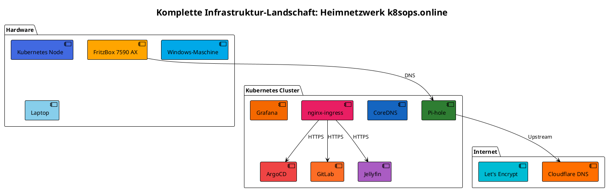
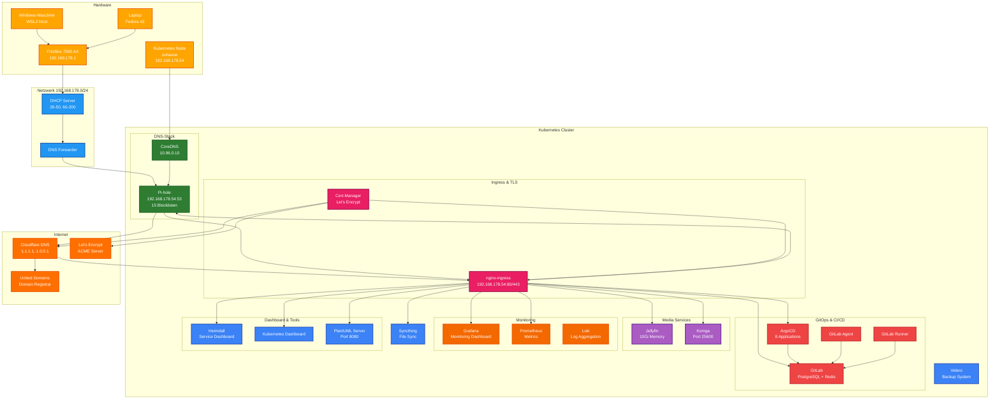
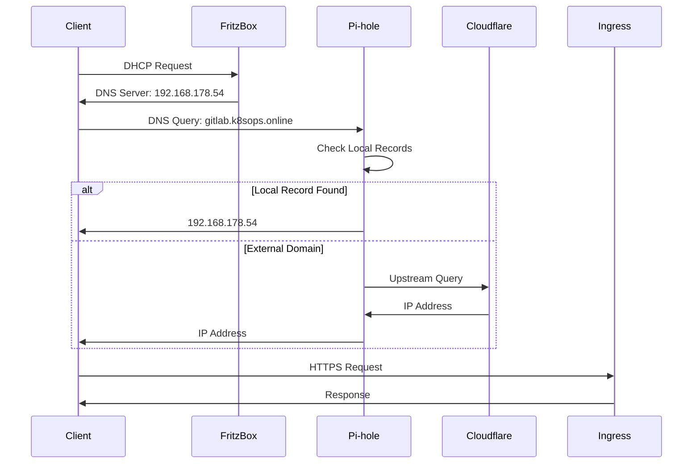
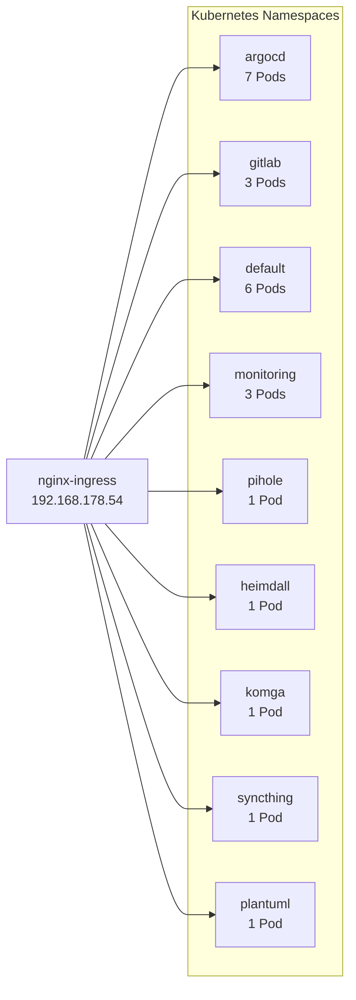

# Infrastruktur-Visualisierung: Komplette Landschaft

**Erstellt**: 2025-11-09  
**Zweck**: Umfassende Visualisierung der Infrastruktur mit verschiedenen Techniken

---

## Übersicht

Diese Dokumentation visualisiert die komplette Infrastruktur-Landschaft mit:
- **PlantUML**: Strukturierte Diagramme (eigener Server)
- **Mermaid**: Native GitHub/GitLab Unterstützung
- **ASCII-Art**: Textbasierte Übersicht

---

## Infrastruktur-Komponenten

### Hardware
- **FritzBox 7590 AX**: Router/Gateway (192.168.178.1)
- **Kubernetes Node**: `zuhause` (192.168.178.54)
- **Windows-Maschine**: WSL2 Host
- **Laptop**: Client-Gerät (Fedora 42)

### Netzwerk
- **Heimnetzwerk**: 192.168.178.0/24
- **Kubernetes Pod Network**: 10.244.0.0/16
- **Kubernetes Service Network**: 10.96.0.0/12

### DNS
- **Pi-hole**: 192.168.178.54 (Host-Netzwerk, Port 53)
- **CoreDNS**: 10.96.0.10 (Kubernetes DNS)
- **Upstream DNS**: Cloudflare (1.1.1.1, 1.0.0.1)

### Services (Kubernetes)
- **ArgoCD**: GitOps Platform
- **GitLab**: Git Repository
- **Pi-hole**: DNS & Ad-Blocking
- **Jellyfin**: Media Server
- **Komga**: Comic Server
- **Syncthing**: File Sync
- **Heimdall**: Dashboard
- **Grafana**: Monitoring Dashboard
- **Prometheus**: Metrics Collection
- **Loki**: Log Aggregation
- **Kubernetes Dashboard**: Cluster Management
- **PlantUML**: Diagram Generator

---

## 1. PlantUML Visualisierung

### ⚠️ Wichtig: GitHub rendert PlantUML nicht nativ!

GitHub unterstützt **keine** native PlantUML-Rendering. PlantUML-Code-Blöcke werden als Code angezeigt, nicht als Diagramm.

**Lösung**: PlantUML-Diagramme müssen als **Bilder** eingebunden werden.

### Komplettes Infrastruktur-Diagramm

**PlantUML-Code** (siehe `infrastruktur-plantuml.puml` für vollständigen Code):



**Gerendertes Diagramm** (als Bild eingebunden):

![Infrastruktur-Diagramm](https://plantuml.k8sops.online/png/eJyFV91y2zYWvudTnLVmmnS3Ukj90LIudipRkuNGdhQrTjo7uoFISEJFASoI2nE6ue0D9Bn6Jn2TPskegBRFWpBqjz0ADojz4fx--DFRRKp0G8MNX0qSKJluVCrrE8KjJFyTpXL-pdZ0S2EXE8adZMP4jkiyhQUJNyspUh4FIhYSamPzU9oR0SVJYzUWXM3YVwqe6ziKqZjCO7HdxVQpelJrD95StuVUfX2icgObbiJ2SUPwmHHqOK_gLZHRE5G0ro8SnHJFubNDSGRF4WIvvYDfHIBwvwUuxpKprwPxBS47Vy70f74AksBSLy5wEa_Q77iu-QiAC8Qn2WqNYO5Fqqh8c00UfSLPc-5dNRue3214l_g358O3wRRmVD5SiZO7GYyFRP0RlXjSN_yroniXLqjEu9EE7kREDQi8Iccx1NqefzXyLBjeigT_f03XJE3onN9Me1CG0WnP-ftZD4Z0wQgHrznn77pJDx69Rqvd8KxAPjMeiaekfkvQ6mhZg-QpW4Sa6_a7o64FyefZpGngzHl-AuhLBzHDU-f879__gMLQ2jRW3ROyU2JnNMZmCLXuZTAaDSwKs5Pr11T-9ScqGNNISALt5ild33SI3OXBU5_h3cK1OoTHXlKxn_um2T6KF32igRitw92Z-LiZ1gdUUlTTm_OmW--4P4Dv1puua-LhpaesBqnETaaUJ8unvdbsUqXQCeI0waA8XOtYlt3nlfZOXYcnC2mCC8UXZl3h7CK_UwnOlNXXIs5CYsf0EGrN0eWw1cz3vrTAcThOhURJpwWv1xgsaPUnITffY_Z0YBCLcBMzBMlx3vBvYSi2WGASWGgJo1IZJd_M_5fYAiEpYjfYQhyjoaDmdfxO4J4G5zau_Ibb8NAluZl7kF_SpArkFoIhS0KBqfxcIMid9QrL1UrSJIHv4ONkVrZkRWCxJl8x_qXOsl0Gdz6G2ujKG_ktK-6JINGAxISHurCcNnHXfdNut84ZDO2JWc4RaxZaeKDarrBqB02v2xnYtVP1KoERD-XzDrMuiEUaLWMsqzqeXCx7eNX6__AgtmQbrIzH5rpm6v1OGyW4eRMMy_aqSiwG68uV0ALESnAYRmiocRt_rFDz46YxUUsht3Pehf5uF7OQKCZ4Muf9VIn67JmHQDaKPf5DfOFxE7IwylfYsMgCkzDwh03_lHK4pzuRMCXks_ZJotC3sw8T-A8KIob674XAnYOfR176RH75tdFo_KN66K9wVgJB9HyP5MQ39ynnuYuzj6RZKH1VOOcWkRGwlYWqxOKcn2gcPy8ZN3p-ySdQ6_c7QWCP5MOROpI995rh0taYC_sTBNMHtNSvKU1UcsYw2OxXJGuXegS11qDbHNu9EogtCwuNzY6PhVtny3GUjhnWNh0b1XqsVxR2xZVRmOxnL5SWVRYHzTlWVUWXaTyjqkjSVrddsb_gOmD0kd9hpq-wQqwqXijkFg9cS7LEdM4cnY3Rx22_69orYEnZkCTrhcDyh1kRbRk3QkVW_tUZy0-l2FIkgmlWvHbFFNPS7zSbwQmvK8lCbEcijmmoUxGNkS4wL6EfYmid8_VEbFjGDnCA3GDQCU54Gm2HuYIZtyKZijsBn-mi_nBz7Ovi8rpSCxFX2-FLocXwmpZGJI4NtHU-ORuIRVs52B0BImhMGR3zDPvXuZg_dPXihD1jjHABdTf9YNSxJ0HGAyAr_VtDz_Z40API3hXedIPc-Yzrsf-oh9tJnkuZ__WafjXUPHdw1fWsyoeMrPQ74JpiBSIYfYd21XXPGaHw1gA9k-6qafmJxlQKg-LRDKHmt3x_bKPM2feYkmgEbAq3jN-8h1kLZggG7XHgiqMvShv5UA1Ljd1I1BE1rLbDrKkelpC0-WMrVXzY4XOHolnwK138zO8P4CE1cc1bAmkgZtsji3Tdqj58rDy63KWzhKEqodlck_hBMGxbcPSD21FRHo87-bGiB6wgNNrzNKMpNUtRztxqnWHbbV1adGXfoKNXyPgksd7L-OETlQt8UaQcW51TvMvq9f9mBLwHpZeWY5aMzPDkHlRfXtmqluf0NdvwIUVmB691JCI1_d5x9u8dvbNQmWvKe5KTv1DObXFyLXpPKRCqDi9v2hNAXcBCEhtwr__dqFgG4e35beUi-S3NkfuXo1Gcb-6BJrTmxAPvxcP2OvXenFbhw_Ljx-msIspJj01UdHubMOvKNsmhfVr15R3MJiu1Gpu4KMFWPHmJtJ67L2FW4d7QmcjZ02UtK6dXnkbBGhFQDNrKxkoUGMp8YuMhEjAPIcjyEKkr1iEn91LFK1XC6ZTZYWWfIZDYfJEBmubrVChhZauh4Tl7xOsekOtd1TTvwR3Z0iTLwRc7DzfRsXdPMR6jxBbVP1LM8m38f4aawcU=)

**Hinweis**: Dieses Bild wird von deinem PlantUML-Server (`plantuml.k8sops.online`) gerendert. Für GitHub Public Repos würde das nicht funktionieren, da GitHub nicht auf private Server zugreifen kann.

**Vorteile**:
- ✅ Läuft auf eigenem Server
- ✅ Sehr mächtige Diagramm-Typen
- ✅ Textbasiert, versionierbar

**Nachteile**:
- ⚠️ GitHub kann nicht auf private Server zugreifen (für Public Repos)
- ⚠️ Encoding erforderlich

---

## 2. Mermaid Visualisierung (GitHub/GitLab Native)

### Infrastruktur-Übersicht

````markdown

````

**Vorteile**:
- ✅ Native Unterstützung in GitHub/GitLab
- ✅ Rendert direkt im Markdown
- ✅ Keine externe Abhängigkeit

**Nachteile**:
- ⚠️ Begrenzte Diagramm-Typen
- ⚠️ Weniger mächtig als PlantUML

---

## 3. DNS-Flow Diagramm (Mermaid)

````markdown

````

---

## 4. Kubernetes Services Übersicht (Mermaid)

````markdown

````

---

## Vergleich: GitHub vs GitLab

### GitHub

**Vorteile**:
- ✅ Mermaid native Unterstützung
- ✅ PlantUML über plantuml.com möglich
- ✅ Große Community
- ✅ Gute Markdown-Rendering

**Nachteile**:
- ⚠️ Kann nicht auf private Server zugreifen
- ⚠️ PlantUML nur über externe Services

**Empfehlung für GitHub**:
1. **Mermaid** (primär) - Native Unterstützung
2. **PlantUML** (via plantuml.com) - Für komplexe Diagramme
3. **Rendered Images** - Für Graphviz/komplexe Visualisierungen

### GitLab

**Vorteile**:
- ✅ Mermaid native Unterstützung
- ✅ PlantUML über plantuml.com möglich
- ✅ Kann auf private Server zugreifen (wenn konfiguriert)
- ✅ PlantUML über eigenen Server möglich

**Nachteile**:
- ⚠️ Kleinere Community als GitHub

**Empfehlung für GitLab**:
1. **Mermaid** (primär) - Native Unterstützung
2. **PlantUML** (via plantuml.k8sops.online) - Eigener Server
3. **Rendered Images** - Für komplexe Visualisierungen

---

## Weitere Visualisierungstechniken

### 1. Graphviz/DOT

**Vorteile**:
- ✅ Sehr mächtig für komplexe Graphen
- ✅ Viele Layout-Algorithmen
- ✅ Export in viele Formate

**Nachteile**:
- ⚠️ Nicht nativ in GitHub/GitLab
- ⚠️ Rendering erforderlich

**Verwendung**:
- Lokal rendern und als Bild committen
- Oder: Online-Tools nutzen (z.B. graphviz.org)

### 2. ASCII-Art

**Vorteile**:
- ✅ Funktioniert überall
- ✅ Keine Rendering-Abhängigkeit
- ✅ Einfach zu editieren

**Nachteile**:
- ⚠️ Nicht so visuell ansprechend
- ⚠️ Manuelle Formatierung

**Beispiel**:
```
┌─────────────────┐
│   FritzBox      │
│ 192.168.178.1   │
└────────┬────────┘
         │
    ┌────┴────┐
    │         │
┌───▼───┐ ┌──▼───┐
│ Pi-hole│ │Ingress│
│  :53   │ │ :80/443│
└────────┘ └───────┘
```

### 3. C4 Model (PlantUML)

**Vorteile**:
- ✅ Strukturierte Architektur-Diagramme
- ✅ Mehrere Abstraktionsebenen
- ✅ Standardisiert

**Nachteile**:
- ⚠️ Komplexere Syntax
- ⚠️ Rendering erforderlich

---

## Webinterfaces & Zugangsdaten

### ArgoCD
- **URL**: https://argocd.k8sops.online
- **Benutzername**: `admin`
- **Passwort**: `Montag69`

### GitLab
- **URL**: https://gitlab.k8sops.online
- **Root-Passwort**: `BXE1uwajqBDLgsWiesGB1081`

### Grafana
- **URL**: https://grafana.k8sops.online
- **Benutzername**: `admin`
- **Passwort**: `Montag69`

### Pi-hole
- **URL**: https://pihole.k8sops.online/admin/
- **Benutzername**: `admin`
- **Passwort**: `cK1lubq8C7MZrEgipfUpEAc0`

### Jellyfin
- **URL**: https://jellyfin.k8sops.online
- **Benutzername**: `bernd`
- **Passwort**: `Montag69`

### Komga
- **URL**: https://komga.k8sops.online
- **Email**: `admin@k8sops.online`
- **Passwort**: `1zBlOIBqlGTHxb15GnGqyPOi`

### Syncthing
- **URL**: https://syncthing.k8sops.online
- **Zugangsdaten**: Erste Einrichtung über Webinterface erforderlich

### Kubernetes Dashboard
- **URL**: https://dashboard.k8sops.online
- **Zugangsdaten**: Service Account Token erforderlich

### Heimdall
- **URL**: https://heimdall.k8sops.online
- **Zugangsdaten**: Kein Login erforderlich

### PlantUML
- **URL**: https://plantuml.k8sops.online
- **Zugangsdaten**: Kein Login erforderlich

### Prometheus
- **URL**: https://prometheus.k8sops.online
- **Zugangsdaten**: Kein Login erforderlich

**Vollständige Liste**: Siehe [webinterfaces-zugangsdaten-2025-11-08.md](./webinterfaces-zugangsdaten-2025-11-08.md)

---

## Empfehlungen

### Für GitHub Public Repos
1. **Mermaid** (primär) - Native Unterstützung
2. **PlantUML** (via plantuml.com) - Für komplexe Diagramme
3. **Rendered Images** - Für Graphviz/komplexe Visualisierungen

### Für GitHub Private Repos / GitLab
1. **Mermaid** (primär) - Native Unterstützung
2. **PlantUML** (via plantuml.k8sops.online) - Eigener Server
3. **Rendered Images** - Für komplexe Visualisierungen

### Für lokale Dokumentation
1. **PlantUML** (via plantuml.k8sops.online) - Eigener Server
2. **Mermaid** - Via Viewer-Tools
3. **Graphviz** - Lokal rendern

---

**Ende der Dokumentation**

