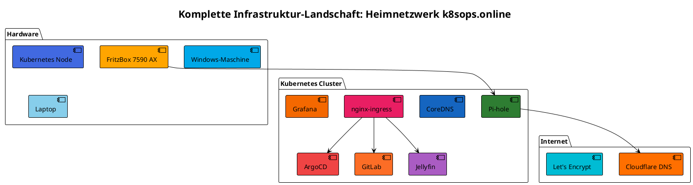

# Infrastruktur-Visualisierung: Komplette Landschaft

**Erstellt**: 2025-11-09  
**Zweck**: Umfassende Visualisierung der Infrastruktur mit verschiedenen Techniken

---

## Übersicht

Diese Dokumentation visualisiert die komplette Infrastruktur-Landschaft mit:
- **PlantUML**: Strukturierte Diagramme (eigener Server)
- **Mermaid**: Native GitHub/GitLab Unterstützung
- **ASCII-Art**: Textbasierte Übersicht

---

## Infrastruktur-Komponenten

### Hardware
- **FritzBox 7590 AX**: Router/Gateway (192.168.178.1)
- **Kubernetes Node**: `zuhause` (192.168.178.54)
- **Windows-Maschine**: WSL2 Host
- **Laptop**: Client-Gerät (Fedora 42)

### Netzwerk
- **Heimnetzwerk**: 192.168.178.0/24
- **Kubernetes Pod Network**: 10.244.0.0/16
- **Kubernetes Service Network**: 10.96.0.0/12

### DNS
- **Pi-hole**: 192.168.178.54 (Host-Netzwerk, Port 53)
- **CoreDNS**: 10.96.0.10 (Kubernetes DNS)
- **Upstream DNS**: Cloudflare (1.1.1.1, 1.0.0.1)

### Services (Kubernetes)
- **ArgoCD**: GitOps Platform
- **GitLab**: Git Repository
- **Pi-hole**: DNS & Ad-Blocking
- **Jellyfin**: Media Server
- **Komga**: Comic Server
- **Syncthing**: File Sync
- **Heimdall**: Dashboard
- **Grafana**: Monitoring Dashboard
- **Prometheus**: Metrics Collection
- **Loki**: Log Aggregation
- **Kubernetes Dashboard**: Cluster Management
- **PlantUML**: Diagram Generator

---

## 1. PlantUML Visualisierung

### Komplettes Infrastruktur-Diagramm

**PlantUML-Code** (siehe `infrastruktur-plantuml.puml` für vollständigen Code):



**Gerendertes Diagramm** (als Bild eingebunden):

**Option 1: Direkte URL** (funktioniert in GitLab, wenn Server erreichbar):

⚠️ **Hinweis**: Die direkte URL kann manchmal die Welcome-Seite statt des Diagramms anzeigen. Verwende Option 2 (Asset) für zuverlässige Anzeige.


**Option 2: Als Asset** (funktioniert immer, auch in GitHub Public Repos):


**Hinweis**: 
- Option 1 nutzt deinen PlantUML-Server (`plantuml.k8sops.online`) - funktioniert in GitLab, wenn der Server erreichbar ist
- Option 2 ist ein gerendertes PNG-Asset, das immer funktioniert (auch in GitHub Public Repos)

**Vorteile**:
- ✅ Läuft auf eigenem Server
- ✅ Sehr mächtige Diagramm-Typen
- ✅ Textbasiert, versionierbar

**Nachteile**:
- ⚠️ GitHub kann nicht auf private Server zugreifen (für Public Repos)
- ⚠️ Encoding erforderlich

---

## 2. Mermaid Visualisierung (GitHub/GitLab Native)

### Infrastruktur-Übersicht

````markdown

````

**Vorteile**:
- ✅ Native Unterstützung in GitHub/GitLab
- ✅ Rendert direkt im Markdown
- ✅ Keine externe Abhängigkeit

**Nachteile**:
- ⚠️ Begrenzte Diagramm-Typen
- ⚠️ Weniger mächtig als PlantUML

---

## 3. DNS-Flow Diagramm (Mermaid)

````markdown

````

---

## 4. Kubernetes Services Übersicht (Mermaid)

````markdown

````

---

## Vergleich: GitHub vs GitLab

### GitHub

**Vorteile**:
- ✅ Mermaid native Unterstützung
- ✅ PlantUML über plantuml.com möglich
- ✅ Große Community
- ✅ Gute Markdown-Rendering

**Nachteile**:
- ⚠️ Kann nicht auf private Server zugreifen
- ⚠️ PlantUML nur über externe Services

**Empfehlung für GitHub**:
1. **Mermaid** (primär) - Native Unterstützung
2. **PlantUML** (via plantuml.com) - Für komplexe Diagramme
3. **Rendered Images** - Für Graphviz/komplexe Visualisierungen

### GitLab

**Vorteile**:
- ✅ Mermaid native Unterstützung
- ✅ PlantUML über plantuml.com möglich
- ✅ Kann auf private Server zugreifen (wenn konfiguriert)
- ✅ PlantUML über eigenen Server möglich

**Nachteile**:
- ⚠️ Kleinere Community als GitHub

**Empfehlung für GitLab**:
1. **Mermaid** (primär) - Native Unterstützung
2. **PlantUML** (via plantuml.k8sops.online) - Eigener Server
3. **Rendered Images** - Für komplexe Visualisierungen

---

## Weitere Visualisierungstechniken

### 1. Graphviz/DOT

**Vorteile**:
- ✅ Sehr mächtig für komplexe Graphen
- ✅ Viele Layout-Algorithmen
- ✅ Export in viele Formate

**Nachteile**:
- ⚠️ Nicht nativ in GitHub/GitLab
- ⚠️ Rendering erforderlich

**Verwendung**:
- Lokal rendern und als Bild committen
- Oder: Online-Tools nutzen (z.B. graphviz.org)

### 2. ASCII-Art

**Vorteile**:
- ✅ Funktioniert überall
- ✅ Keine Rendering-Abhängigkeit
- ✅ Einfach zu editieren

**Nachteile**:
- ⚠️ Nicht so visuell ansprechend
- ⚠️ Manuelle Formatierung

**Beispiel**:
```
┌─────────────────┐
│   FritzBox      │
│ 192.168.178.1   │
└────────┬────────┘
         │
    ┌────┴────┐
    │         │
┌───▼───┐ ┌──▼───┐
│ Pi-hole│ │Ingress│
│  :53   │ │ :80/443│
└────────┘ └───────┘
```

### 3. C4 Model (PlantUML)

**Vorteile**:
- ✅ Strukturierte Architektur-Diagramme
- ✅ Mehrere Abstraktionsebenen
- ✅ Standardisiert

**Nachteile**:
- ⚠️ Komplexere Syntax
- ⚠️ Rendering erforderlich

---

## Webinterfaces & Zugangsdaten

### ArgoCD
- **URL**: https://argocd.k8sops.online
- **Benutzername**: `admin`
- **Passwort**: `Montag69`

### GitLab
- **URL**: https://gitlab.k8sops.online
- **Root-Passwort**: `BXE1uwajqBDLgsWiesGB1081`

### Grafana
- **URL**: https://grafana.k8sops.online
- **Benutzername**: `admin`
- **Passwort**: `Montag69`

### Pi-hole
- **URL**: https://pihole.k8sops.online/admin/
- **Benutzername**: `admin`
- **Passwort**: `cK1lubq8C7MZrEgipfUpEAc0`

### Jellyfin
- **URL**: https://jellyfin.k8sops.online
- **Benutzername**: `bernd`
- **Passwort**: `Montag69`

### Komga
- **URL**: https://komga.k8sops.online
- **Email**: `admin@k8sops.online`
- **Passwort**: `1zBlOIBqlGTHxb15GnGqyPOi`

### Syncthing
- **URL**: https://syncthing.k8sops.online
- **Zugangsdaten**: Erste Einrichtung über Webinterface erforderlich

### Kubernetes Dashboard
- **URL**: https://dashboard.k8sops.online
- **Zugangsdaten**: Service Account Token erforderlich

### Heimdall
- **URL**: https://heimdall.k8sops.online
- **Zugangsdaten**: Kein Login erforderlich

### PlantUML
- **URL**: https://plantuml.k8sops.online
- **Zugangsdaten**: Kein Login erforderlich

### Prometheus
- **URL**: https://prometheus.k8sops.online
- **Zugangsdaten**: Kein Login erforderlich

**Vollständige Liste**: Siehe [webinterfaces-zugangsdaten-2025-11-08.md](./webinterfaces-zugangsdaten-2025-11-08.md)

---

## Empfehlungen

### Für GitHub Public Repos
1. **Mermaid** (primär) - Native Unterstützung
2. **PlantUML** (via plantuml.com) - Für komplexe Diagramme
3. **Rendered Images** - Für Graphviz/komplexe Visualisierungen

### Für GitHub Private Repos / GitLab
1. **Mermaid** (primär) - Native Unterstützung
2. **PlantUML** (via plantuml.k8sops.online) - Eigener Server
3. **Rendered Images** - Für komplexe Visualisierungen

### Für lokale Dokumentation
1. **PlantUML** (via plantuml.k8sops.online) - Eigener Server
2. **Mermaid** - Via Viewer-Tools
3. **Graphviz** - Lokal rendern

---

**Ende der Dokumentation**
