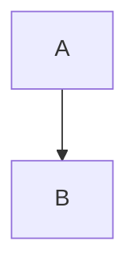

# Infrastruktur-Visualisierung: Heimnetzwerk k8sops.online

**Erstellt**: 2025-11-09  
**Zweck**: Komplette Visualisierung der Infrastruktur-Landschaft mit verschiedenen Techniken

---

## Übersicht

Diese Dokumentation visualisiert die komplette Infrastruktur-Landschaft mit:
- **PlantUML**: Strukturierte Diagramme
- **Mermaid**: Interaktive Diagramme (GitHub/GitLab native)
- **Graphviz/DOT**: Alternative Visualisierung
- **ASCII-Art**: Textbasierte Übersicht

---

## Infrastruktur-Komponenten

### Hardware
- **FritzBox 7590 AX**: Router/Gateway (192.168.178.1)
- **Kubernetes Node**: `zuhause` (192.168.178.54)
- **Windows-Maschine**: WSL2 Host
- **Laptop**: Client-Gerät

### Netzwerk
- **Heimnetzwerk**: 192.168.178.0/24
- **Kubernetes Pod Network**: 10.244.0.0/16
- **Kubernetes Service Network**: 10.96.0.0/12

### DNS
- **Pi-hole**: 192.168.178.54 (Host-Netzwerk, Port 53)
- **CoreDNS**: 10.96.0.10 (Kubernetes DNS)
- **Upstream DNS**: Cloudflare (1.1.1.1, 1.0.0.1)

### Services (Kubernetes)
- **ArgoCD**: GitOps Platform
- **GitLab**: Git Repository
- **Pi-hole**: DNS & Ad-Blocking
- **Jellyfin**: Media Server
- **Komga**: Comic Server
- **Syncthing**: File Sync
- **Heimdall**: Dashboard
- **Grafana**: Monitoring Dashboard
- **Prometheus**: Metrics Collection
- **Loki**: Log Aggregation
- **Kubernetes Dashboard**: Cluster Management
- **PlantUML**: Diagram Generator

---

## Visualisierungstechniken

### 1. PlantUML (Dein Server)

**Vorteile**:
- ✅ Läuft auf eigenem Server (`plantuml.k8sops.online`)
- ✅ Keine Abhängigkeit von externen Diensten
- ✅ Sehr mächtige Diagramm-Typen
- ✅ Textbasiert, versionierbar

**Nachteile**:
- ⚠️ GitHub kann nicht auf private Server zugreifen (für Public Repos)
- ⚠️ Encoding erforderlich für URLs

**Verwendung**:
```markdown

```

### 2. Mermaid (GitHub/GitLab Native)

**Vorteile**:
- ✅ Native Unterstützung in GitHub/GitLab
- ✅ Rendert direkt im Markdown
- ✅ Keine externe Abhängigkeit
- ✅ Einfache Syntax

**Nachteile**:
- ⚠️ Begrenzte Diagramm-Typen
- ⚠️ Weniger mächtig als PlantUML

**Verwendung**:
````markdown

````

### 3. Graphviz/DOT

**Vorteile**:
- ✅ Sehr mächtig für komplexe Graphen
- ✅ Viele Layout-Algorithmen
- ✅ Export in viele Formate

**Nachteile**:
- ⚠️ Nicht nativ in GitHub/GitLab
- ⚠️ Rendering erforderlich

**Verwendung**:
- Lokal rendern und als Bild committen
- Oder: Online-Tools nutzen

### 4. ASCII-Art

**Vorteile**:
- ✅ Funktioniert überall
- ✅ Keine Rendering-Abhängigkeit
- ✅ Einfach zu editieren

**Nachteile**:
- ⚠️ Nicht so visuell ansprechend
- ⚠️ Manuelle Formatierung

---

## Empfehlungen

### Für GitHub Public Repos
1. **Mermaid** (primär) - Native Unterstützung
2. **PlantUML** (via plantuml.com) - Für komplexe Diagramme
3. **Rendered Images** - Für Graphviz/komplexe Visualisierungen

### Für GitHub Private Repos / GitLab
1. **Mermaid** (primär) - Native Unterstützung
2. **PlantUML** (via plantuml.k8sops.online) - Eigener Server
3. **Rendered Images** - Für komplexe Visualisierungen

### Für lokale Dokumentation
1. **PlantUML** (via plantuml.k8sops.online) - Eigener Server
2. **Mermaid** - Via Viewer-Tools
3. **Graphviz** - Lokal rendern

---

## Webinterfaces & Zugangsdaten

Siehe: [webinterfaces-zugangsdaten-2025-11-08.md](./webinterfaces-zugangsdaten-2025-11-08.md)

---

**Ende der Übersicht**

