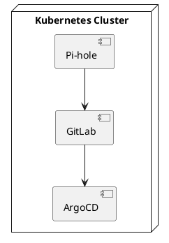
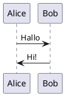
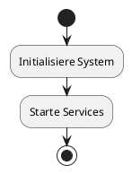

# PlantUML Server für GitHub Markdown Integration

## ✅ Ja, du kannst den PlantUML-Server für GitHub-Markdown-Dokumentationen nutzen!

### PlantUML-Server URL
- **URL**: `https://plantuml.k8sops.online`
- **Status**: ✅ Verfügbar im Heimnetzwerk

---

## Methoden zur Einbindung

### Methode 1: Direkte URL mit PlantUML-Code (Empfohlen)

PlantUML-Server unterstützt die direkte URL-API, bei der der PlantUML-Code als URL-Parameter übergeben wird.

**Syntax:**
```markdown

```

**Beispiel:**
```markdown
# Systemarchitektur


```

**PlantUML-Code für das Beispiel:**


**Wie funktioniert es?**
1. PlantUML-Code wird in eine komprimierte URL-kompatible Form konvertiert (Base64 oder Deflate)
2. Die URL wird in GitHub-Markdown eingebunden
3. GitHub lädt das Bild vom PlantUML-Server

---

### Methode 2: PlantUML Online Encoder verwenden

**Schritt 1:** PlantUML-Code schreiben:


**Schritt 2:** Code auf [plantuml.com/plantuml](http://www.plantuml.com/plantuml) encoden

**Schritt 3:** URL im Markdown verwenden:
```markdown

```

---

### Methode 3: PlantUML-Server API direkt nutzen

**PNG-Format:**
```markdown

```

**SVG-Format (skalierbar):**
```markdown

```

**ASCII-Art:**
```markdown

```

---

## Code-Encoding

### Option 1: Online Encoder
- **PlantUML.com**: http://www.plantuml.com/plantuml/uml/
- Code eingeben → Encoded URL kopieren

### Option 2: Python-Script
```python
import zlib
import base64

def encode_plantuml(code):
    """Encode PlantUML code for URL"""
    compressed = zlib.compress(code.encode('utf-8'))
    encoded = base64.urlsafe_b64encode(compressed).decode('ascii')
    # PlantUML uses a special encoding: replace characters
    encoded = encoded.replace('+', '-').replace('/', '_')
    return encoded

code = """@startuml
Alice -> Bob: Test
@enduml"""
encoded = encode_plantuml(code)
url = f"https://plantuml.k8sops.online/png/{encoded}"
print(url)
```

### Option 3: PlantUML CLI
```bash
# PlantUML installieren
# Dann:
plantuml -encode diagram.puml
```

---

## Praktische Beispiele

### Beispiel 1: Sequenzdiagramm
```markdown

```

### Beispiel 2: Komponentendiagramm
```markdown

```

### Beispiel 3: Aktivitätsdiagramm
```markdown

```

---

## Vorteile der Nutzung des eigenen PlantUML-Servers

1. **Privatsphäre**: Keine Daten werden an externe Server gesendet
2. **Geschwindigkeit**: Lokaler Server im Heimnetzwerk ist schneller
3. **Kontrolle**: Vollständige Kontrolle über den Server
4. **Offline**: Funktioniert auch ohne Internet (wenn GitHub lokal ist)

---

## Einschränkungen

### ⚠️ GitHub Public Repositories
- **Problem**: GitHub kann nicht auf private Server zugreifen (192.168.x.x oder lokale Domains)
- **Lösung**: 
  - Für öffentliche Repos: Externen PlantUML-Server nutzen (z.B. plantuml.com)
  - Für private Repos: GitHub kann auf `plantuml.k8sops.online` zugreifen, wenn der Server öffentlich erreichbar ist

### ⚠️ Lokale Markdown-Viewer
- **Problem**: Lokale Markdown-Viewer können auf `plantuml.k8sops.online` zugreifen, wenn sie im gleichen Netzwerk sind
- **Lösung**: Funktioniert perfekt für lokale Dokumentation

---

## Empfehlung für dein Setup

Da dein PlantUML-Server über `plantuml.k8sops.online` erreichbar ist:

1. **Für GitHub Public Repos**: 
   - Nutze `https://www.plantuml.com/plantuml/png/[CODE]` (öffentlicher Server)
   - Oder: Nutze GitHub Actions, um PlantUML-Diagramme zu rendern und als Assets zu committen

2. **Für GitHub Private Repos / Lokale Docs**:
   - Nutze `https://plantuml.k8sops.online/png/[CODE]` (dein Server)
   - Funktioniert perfekt, wenn GitHub auf deinen Server zugreifen kann

3. **Für lokale Markdown-Dokumentation**:
   - Nutze `https://plantuml.k8sops.online/png/[CODE]` (dein Server)
   - Funktioniert perfekt im Heimnetzwerk

---

## Quick Start

1. **PlantUML-Code schreiben**:


2. **Code encoden** (z.B. auf plantuml.com)

3. **In Markdown einbinden**:
```markdown

```

---

**Ende der Dokumentation**

